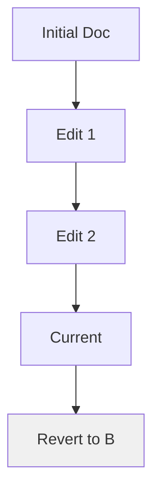

## Overview

Flyde provides powerful tools to streamline your documentation workflow. You organize content into intuitive folder structures, collaborate seamlessly with your team, track every change with version history, and discover information quickly using search and tags. These features ensure your project docs stay current and accessible.

<Columns cols={3}>
  <Card title="Document Organization" icon="folder" href="#document-organization">
    Structure your docs with nested folders and intuitive navigation.
  </Card>
  <Card title="Team Collaboration" icon="users" href="#team-collaboration">
    Edit, review, and merge changes in real-time with your team.
  </Card>
  <Card title="Version History" icon="git-branch" href="#version-history">
    Track changes, revert updates, and maintain a complete audit trail.
  </Card>
</Columns>

## Document Organization

Create a logical folder structure to keep your documentation scalable. Flyde supports unlimited nesting, custom sidebar menus, and automatic indexing.

<Steps>
  <Step title="Create Folders" icon="folder-plus">
    Navigate to your workspace root and select **New Folder**. Name it based on your project sections, such as `guides/` or `api/`.
  </Step>
  <Step title="Add Documents" icon="file-text">
    Inside a folder, create MDX pages. Flyde auto-generates navigation links.
  </Step>
  <Step title="Reorder Structure" icon="move">
    Drag and drop folders and files in the sidebar to customize the hierarchy.
  </Step>
</Steps>

<Callout kind="tip">
  Use frontmatter in your MDX files to set custom order: `order: 1`.
</Callout>

## Team Collaboration

Invite team members to co-edit docs without version conflicts. Flyde offers real-time editing, comments, and approval workflows.

<Tabs>
  <Tab title="Editor Role" icon="edit-3">
    Make live changes with cursor indicators showing who edits what.
  </Tab>
  <Tab title="Reviewer Role" icon="eye">
    Add inline comments and suggest edits. Approve changes before publishing.
  </Tab>
  <Tab title="Admin Role" icon="shield">
    Manage permissions and resolve merge conflicts automatically.
  </Tab>
</Tabs>

For programmatic collaboration, use the Flyde API:

<CodeGroup tabs="JavaScript,Python">
  ```javascript
  const flyde = new FlydeClient({ apiKey: 'YOUR_API_KEY' });
  await flyde.docs.inviteUser('user@example.com', 'editor');
  ```
  ```python
  from flyde import FlydeClient
  client = FlydeClient(api_key='YOUR_API_KEY')
  client.docs.invite_user('user@example.com', 'editor')
  ```
</CodeGroup>

## Version History

Every edit creates a snapshot. You view diffs, revert changes, or branch docs for experiments.



<Expandable title="Advanced Versioning" default-open="false">
  Access full history via API. Compare versions side-by-side.

  ```javascript
  const versions = await flyde.docs.getVersions('guide.mdx');
  const diff = await flyde.docs.diff(versions[0], versions[1]);
  ```
</Expandable>

## Search and Tagging

Quickly find content with full-text search and tags. Assign tags in frontmatter for filtering.

| Feature       | Description                          | Example Usage                  |
|---------------|--------------------------------------|--------------------------------|
| Full-Text Search | Searches titles, content, and metadata | `api integration` finds all API docs |
| Tags          | Custom labels for categorization     | `tags: ["feature", "guide"]`  |
| Advanced Filters | Combine search with tags/folders     | `status: draft AND api`       |

<Callout kind="info">
  Tags sync across your workspace. Use them to power dynamic menus.
</Callout>

Start by adding tags to your frontmatter:

```
---
title: My Guide
tags: ["beginner", "api"]
---
```

These core features make Flyde your central hub for documentation excellence. Explore further by organizing your first folder structure today.